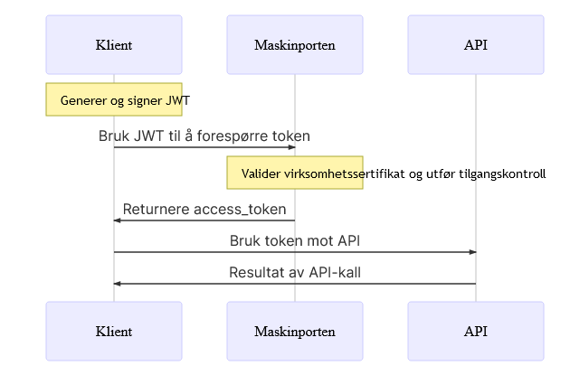

## Oppslagstjenesten KRR

Digitaliseringsdirektoraret (DigDir) har laget en stegvis plan for hvordan man kan gjøre oppslag i KRR: https://samarbeid.digdir.no/kontaktregisteret/ta-i-bruk-kontaktregisteret/95

Punkt 1.1, 1.3 og 1.4 beskrives ikke her. 

### Beskrivelse av oppsett



Før man kan gjøre oppslag i KRR via API, må man autentisere seg via en klient i Maskinporten. Klienten, eller integrasjonen som det også omtales som, settes opp ved hjelp av tasteklikk og menyvalg. Se 2.1 under. 

Autentiseringen skjer ved hjelp av nøklene generert i 1.5. Klienten (et Python-program i vårt tilfelle)  generer, og signerer en JWT-forepørsel om token til klienten i Maskinporten. Hvis autentiseringen vellykkes, returneres det et `access_token` som er gyldig i 120 sekunder. Deretter bruker Python-programmet det tildelte `token` til å identifisere seg selv mot APIet, og får resultatet i retur hvis `access_token` er gyldig.

Hvis man skal gjøre flere oppslag, må det genereres et nytt `access_token`. Det er mulig å slå opp i bolk fra 1-1000 personer. Hvis man eksempelvis skal gjøre oppslag på 10 000 personer, må man generere 10 forskjellige token. 


### 1.2 Opprett kunde i samarbeidsportalen

Gå til samarbeid.digdir.no for å opprette en bruker. I forkant må Digdir opprette din bedrift som kunde. Samtidig definerer Digdir hvilket domene som er assosiert med din bedrift. Du må derfor registrere deg med bedriftens epost for å få de nødvendige tilgangene. 

### 1.5 Virksomhetssertifikat/nøkler

Istedet for å bestille virksomhetssertifikat via Buypass eller Comfides, kan man også opprette egne private nøkler. 

Man kan enten benytte https://mkjwk.org/ for å generere nøkler (disclaimer: her må man anta at nettsiden ikke misbruker/lagrer nøkkelparet du genererer). Det er også mulig å benytte openssl lokalt.

Hvordan bruke openssl:
- Bruk en lokal installasjon, feks: `C:\Program Files\Git\usr\bin\openssl.exe`  
- Kjør programmet med admin-rettigheter.  
- Her er en guide til hvordan man kan bruke openssl til å generere nøkler: https://auth0.com/docs/secure/application-credentials/generate-rsa-key-pair  
- Generere privat nøkkel: `openssl genrsa -out test_key.pem 2048`  
- Generere public nøkkel: `openssl rsa -in test_key.pem -outform PEM -pubout -out test_key.pem.pub`  
- Lagre nøklene et trygt sted, og aldri del den hemmelige nøkkelen.  

### 2.1 Opprette KRR-klient i testmiljøet

Gå til samarbeid.digdir.no, og logg inn med brukeren du opprettet i 1.2. Velg deretter `integrasjoner`, og `selvbetjening`. Under `Test`, klikker du på `Integrasjoner`. Hvis du blir bedt om å logge inn, bruk samme bruker som i 1.2. Klikk på `Integrasjoner`, og deretter `+ Ny integrasjon`.

Digdirs guide: https://docs.digdir.no/docs/Kontaktregisteret/krr_opprette_klient

- Difi-tjeneste: KRR.  
- Scopes: Skal defineres automatisk, men for oppslag i KRR er det `krr:global/kontaktinformasjon.read` som er relevant.  
- Hvis man er leverandør til kunde (databehandler og behandlingsansvarlig), skal kundens organisasjonsnummer legges til.  
- Integrasjons identifikator: Genereres automatisk. Verdien skal brukes i `jwt_claims`.  
- Navn på integrasjon: Egendefinert, unikt navn på integrasjonen.  
- Beskrivelse: Egendefinert beskrivelse av hva integrasjonen skal brukes til.  
- Tillatte grant types: :`jwt-bearer`.  
- Klientautentiseringsmetode: `private_key_jwt`.  
- Applikasjonstyper: `web`.  
- Øvrige: Ok med default-verdier.  

#### Legge til nøkkel i klient
Public-nøkkelen skal legges til i klienten, struktuert som JWK. Digdirs manual om hvordan nøkkelen skal registreres: https://docs.digdir.no/docs/Maskinporten/maskinporten_sjolvbetjening_web#registrere-n%C3%B8kkel-p%C3%A5-klient 

Her er en stegvis guide for hvordan nøkkelen skal legges til i klienten: 

- For å konvertere den åpne nøkkelen i .PEM-format kan man bruke følgende ressurs: https://russelldavies.github.io/jwk-creator/  
- Public Key Use: Signing  
- Algorithm: RS256  
- Key ID: Unik, tilfeldig streng.  
- PEM encoded key: Tekst streng fra `.pem.pub-filen`, generert i 1.5  
- Klikk `Convert`  

Kopier tekstinnholdet, og legg det i en `.txt`-fil i samme mappe som `.pem.pub`-filen. 

Gå deretter til klienten opprettet i 2.1, klikk på `Egne public nøkler` nederst på siden. Lim inn innholdet i vinduet som dukker opp. Husk å legge til `[]` slik det står indikert i vinduet. 

#### Is on behalf
Hvis man er leverandør, må man legge inn hvem som er kunde/behandlingsansvarlig. Dette gjøres helt nederst på siden. Forholdet mellom kunde og leverandør er det Digitaliseringsdirektoratet som etablerer.

- OnBehalfOf-verdi: Tilfeldig, egendefinert streng.  
- Navn: Egendefinert navn 
- Orgnr: Kundens organisasjonsnummer

Merk at OnBehalfOf-verdi må legges til i JWT-claim som et eget parameter. 

### 2.2 Sette opp førespørsler mot KRR

Den første forespørselen mot KRR, er en forespørsel om autentisering. Forespørselen skal generere et token.`ClaimToken.py` er eksempel på et slikt program. 

### 2.3 Slå opp på testbrukere

Token generert i 2.2 brukes deretter til å hente data fra KRRs API. `Lookup.py` er eksempel på et slikt program, som bygger videre på `ClaimToken.py`. 

## Kom i gang med koden

Lag et virtuelt Python-miljø
```
py -m venv .venv
```

Aktiver miljøet
```
py .venv/Scripts/Activate
```

Installer Python-pakker
```
pip install -r requirements.txt
```

- `parameters/*` -> directory med følgende `.txt`-filer: 
    * `consumer.txt`: Fil med kundens organisasjonsnummer
    * `integrationid.txt`: Fil med integrasjonsid fra integrasjon i Maskinporten
    * `iss_onbehalfof.txt`: Fil med iss_onbehalfof-ID fra integrasjon i Maskinporten
    * `kid.txt`: Fil med kid fra JWK-nøkkel lagt inn i integrasjonen i Maskinporten
- `parameters/*` -> Inneholder også hemmelig nøkkel `key.pem`
- `data/*` -> Denne mappen inneholder testbrukere hentet fra Digdirs liste: https://docs.digdir.no/docs/Kontaktregisteret/krr_testbrukere

`client_singl_batch` henter `access_token` og gjør oppslag på én bolk syntetiske brukere fra `data/synteticusers.xlsx`. 

`client_multipl_batches.py` henter syntetiske brukere fra `data/synteticusers.xlsx` og deler dem opp i bolker for å simulere tilfeller hvor man overstiger KRRs begrensning på 1000 oppslag om gangen. 

Programmet generer egen `access_token` for hver bolk, og henter ut data. Data sammenstilles til slutt, og skrives til `data/data.xlsx`.